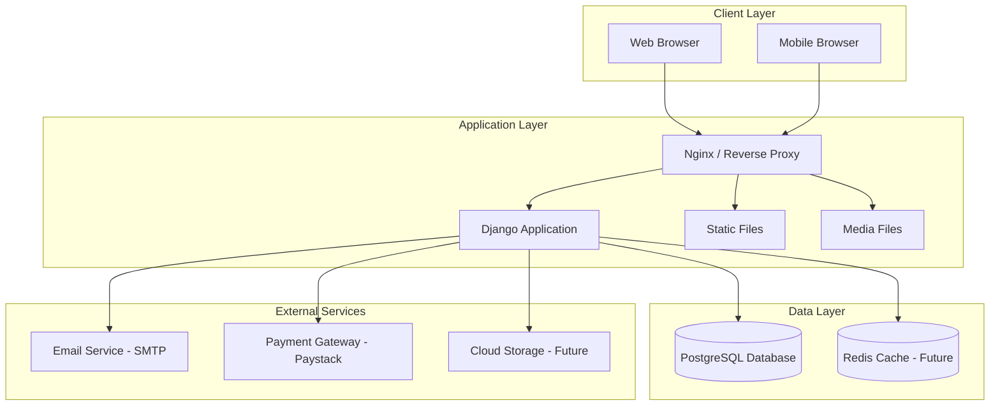
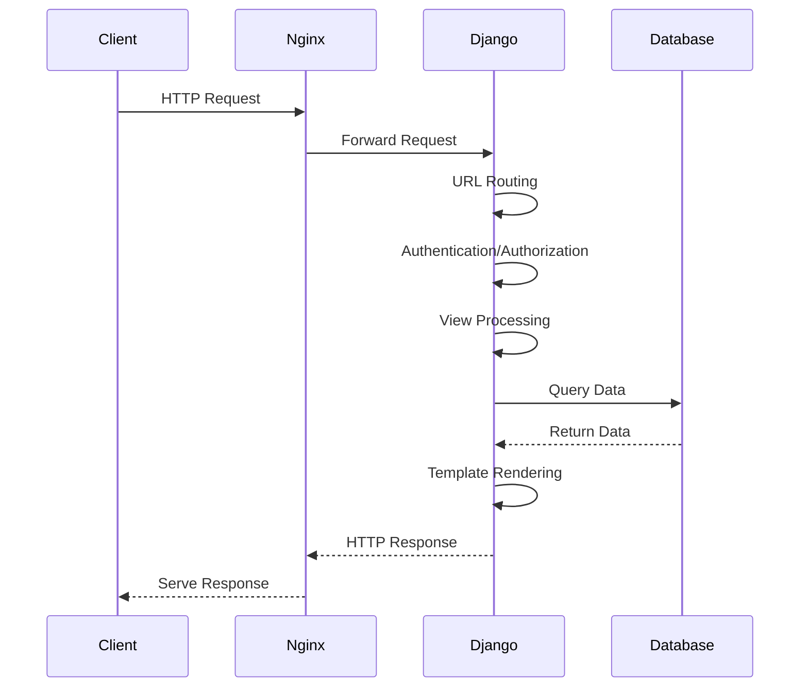
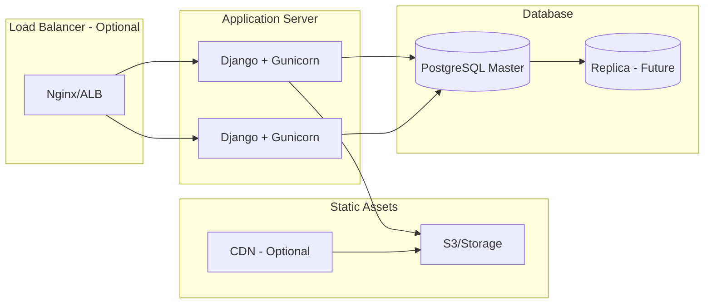

# System Architecture Overview

## 🎯 Executive Summary

LearnSwift Academia is a **monolithic Django web application** providing comprehensive school management and learning management capabilities for an Islamic school in Lagos, Nigeria.

**Architecture Style:** Layered monolith with modular Django apps  
**Deployment Model:** Containerized (Docker) or traditional server deployment  
**Database:** PostgreSQL (production), SQLite (development)

---

## 🏗️ High-Level Architecture



---

## 📦 System Components

### 1. Core Django Apps

#### **core/** - School Management
- Student, Teacher, Guardian CRUD
- Class and Subject management
- Attendance tracking
- Assessment and examination system
- Fee management and financial records
- Blog and content management
- User authentication and authorization

#### **lsalms/** - Learning Management System
- Course creation and management
- Module and lesson organization
- Content delivery (text, video, files)
- Student enrollment and progress tracking
- Quiz and assignment system
- External course catalog (Online Academy)

#### **lsaapp/** - Project Configuration
- Settings management
- URL routing
- WSGI/ASGI configuration
- Middleware configuration

---

## 🔄 Application Flow

### Request-Response Cycle



---

## 🗄️ Data Architecture

### Database Design Principles
- **Normalized design** for data integrity
- **Foreign key relationships** for referential integrity
- **Django ORM** for database abstraction
- **Migration-based** schema evolution

### Key Entity Relationships

```mermaid
erDiagram
    Student ||--o{ Enrollment : has
    Student ||--o{ AssessmentSubmission : submits
    Teacher ||--o{ Course : teaches
    Teacher ||--o{ Class : teaches
    Class ||--o{ Enrollment : contains
    Course ||--o{ Module : contains
    Module ||--o{ Lesson : contains
    Guardian ||--o{ Student : monitors
```

---

## 🔐 Security Architecture

### Authentication & Authorization
- **Session-based authentication** (Django sessions)
- **Role-based access control** (Student, Teacher, Guardian, Admin)
- **Permission-based views** using Django decorators
- **CSRF protection** enabled globally
- **Password hashing** with Django's PBKDF2

### Security Layers
1. **Transport Security:** HTTPS in production
2. **Application Security:** Django middleware, CSRF tokens
3. **Data Security:** Encrypted passwords, SQL injection protection
4. **Access Control:** Role-based permissions, view decorators

---

## 📊 Deployment Architecture

### Production Environment



### Development Environment
- **Database:** SQLite (single file)
- **Server:** Django development server
- **Static Files:** Served by Django
- **Media Files:** Local filesystem

---

## 🎨 Frontend Architecture

### UI Framework
- **Bootstrap 5.3.2** for responsive layout
- **Particles.js** for animated backgrounds
- **Custom CSS** with cyberpunk theme
- **Vanilla JavaScript** for interactivity
- **HTMX** for dynamic content (limited usage)

### Design System
- **Colors:** Cyan (#06b6d4), Purple (#8b5cf6), Pink (#ec4899)
- **Typography:** Space Grotesk (headings), Inter (body)
- **Components:** Glassmorphic cards, gradient buttons, neon effects
- **Responsive:** Mobile-first design

---

## 🔌 Integration Points

### Current Integrations
- **Email (SMTP):** User notifications, password resets
- **Static Files:** WhiteNoise for serving in production

### Planned Integrations
- **Payment Gateway:** Paystack for course subscriptions
- **Cloud Storage:** AWS S3 or Cloudinary for media files
- **SMS Gateway:** For attendance notifications
- **Video Hosting:** YouTube/Vimeo for course videos

---

## 📈 Scalability Considerations

### Current Capacity
- **Users:** Up to 1,000 concurrent users
- **Database:** Single PostgreSQL instance
- **Files:** Local/S3 storage

### Future Scaling Options
1. **Horizontal Scaling:** Multiple Django instances behind load balancer
2. **Database Scaling:** Read replicas, connection pooling
3. **Caching:** Redis for session and query caching
4. **CDN:** For static and media file delivery
5. **Task Queue:** Celery for background jobs

---

## 🔍 Monitoring & Observability

### Current State
- Django debug toolbar (development)
- Application logs
- Database query logs

### Recommended Additions
- **APM:** Sentry for error tracking
- **Logging:** Centralized logging (ELK stack)
- **Metrics:** Prometheus + Grafana
- **Uptime:** UptimeRobot or similar

---

## 🚀 Technology Stack Summary

| Layer | Technology | Purpose |
|-------|-----------|---------|
| **Framework** | Django 5.0.1 | Web application framework |
| **Language** | Python 3.11+ | Backend programming |
| **Database** | PostgreSQL 14+ | Primary data store |
| **ORM** | Django ORM | Database abstraction |
| **Web Server** | Gunicorn | WSGI HTTP server |
| **Reverse Proxy** | Nginx | Static files, load balancing |
| **Frontend** | Bootstrap 5.3.2 | UI framework |
| **Containerization** | Docker | Application packaging |
| **Version Control** | Git | Source code management |

---

## 📝 Design Principles

1. **Separation of Concerns:** Modular Django apps with clear boundaries
2. **DRY (Don't Repeat Yourself):** Reusable components and mixins
3. **Convention over Configuration:** Follow Django best practices
4. **Security by Default:** Enable all Django security features
5. **Responsive Design:** Mobile-first approach
6. **Progressive Enhancement:** Core functionality without JavaScript

---

## 🔮 Future Architecture Considerations

### Short-term (3-6 months)
- [ ] Implement Redis caching
- [ ] Add Celery for background tasks
- [ ] Integrate payment gateway
- [ ] Set up cloud storage for media

### Long-term (6-12 months)
- [ ] Evaluate microservices for LMS
- [ ] Implement GraphQL API
- [ ] Add real-time features (WebSockets)
- [ ] Mobile app development

---

**Last Updated:** January 8, 2026  
**Version:** 1.0.0  
**Status:** Production
